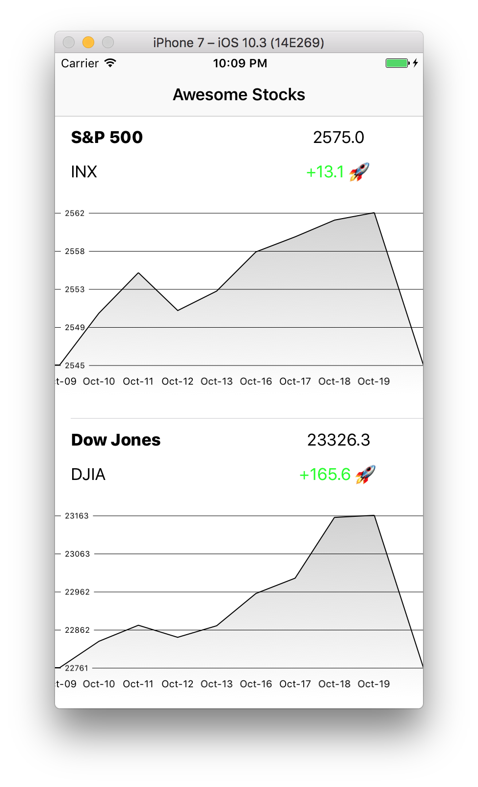

A simple Swift 3 project to show stocks based on MVP design pattern.

Uses the following libs:
- Alamofire
- AlamofireObjectMapper
- ScrollableGraphView

See demo:
https://appetize.io/app/mfq0pg4pj9r1c8uczf0g5dpyy4?device=iphone6s&scale=75&orientation=portrait&osVersion=11.0

